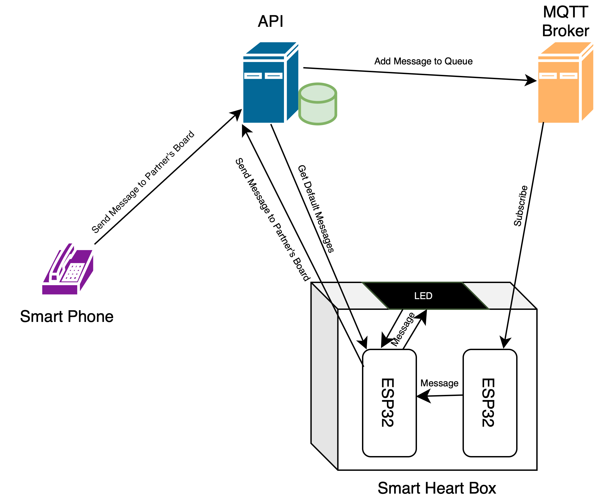
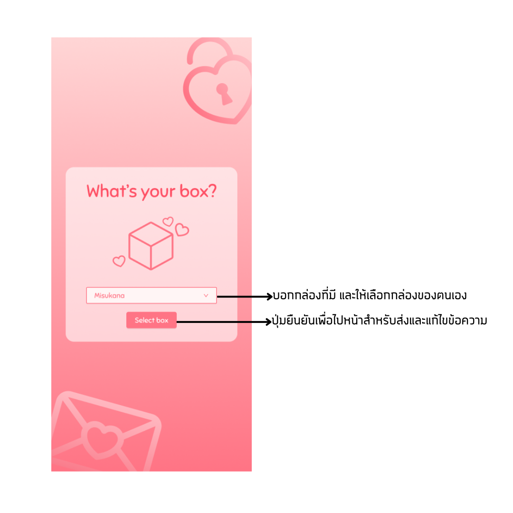
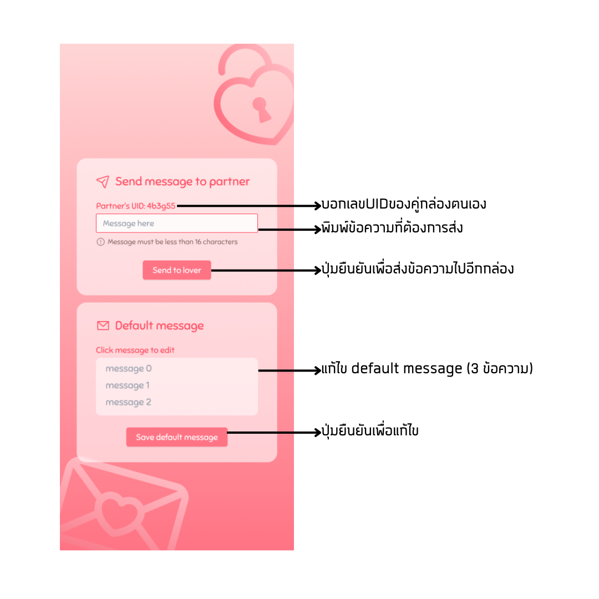

# Smart Heart Box

## ผู้จัดทำ

1. ศิลา สนปี [(Sila Sonpee)](https://github.com/hirasawaau)
2. ศุภวิชญ์ เสรีพาณิชย์การ [(Supawit Seripanitkarn)](https://github.com/karnse)
3. แพรเพชร ต่อไพบูลย์ [(Praepech Tophaiboon)](https://github.com/PraepechPrAe)
4. สิทธิพล เหล่าวิวัฒน์เกษม [(Sittipol Laowiwatkasem)](https://github.com/Linwoo1012)

## รายละเอียดโครงการ

Smart Heart Box ประกอบไปด้วยกล่องอัจฉริยะจำนวน 1 คู่ (2 กล่อง) เป็นอุปกรณ์ที่มีความสามารถในการเชื่อมต่อกันเองและเชื่อมต่อกับเว็บแอปพลิเคชั่น ซึ่งมุ่งเน้นให้ผู้ใช้สามารถสื่อสารความรักและความห่วงใยไปยังคนที่พวกเขารักผ่านทางข้อความได้อย่างไร้ขีดจำกัด

## ที่มาและความสำคัญ

Smart Heart Box เป็นโครงงานที่มีกำหนดการและแรงจูงใจมาจากความต้องการในการสร้างช่องทางสื่อสารและแสดงความรักที่ไม่มีขีดจำกัดระหว่างคน โดยเฉพาะในยุคที่เทคโนโลยีเป็นส่วนสำคัญของชีวิตประจำวัน โครงงานนี้มุ่งเน้นที่การสร้างความใกล้ชิดและความสัมพันธ์ที่แข็งแรงอย่างยั่งยืน การสื่อสารและแสดงความรักผ่าน "Smart Heart Box" มีความสำคัญอย่างมากในการสร้างประสบการณ์ที่ดีและสนับสนุนความสุขของผู้ใช้ทั้งสองฝ่ายโดยไม่ว่าจะอยู่ห่างกันแค่ไหนก็ตาม และสะท้อนถึงความสำคัญของการใช้เทคโนโลยีในการสร้างความเชื่อมโยงและความรักที่แท้จริงในสังคมปัจจุบันได้อย่างมีความสำคัญและมีคุณค่าอย่างแท้จริง

## คุณสมบัติ

- ส่งข้อความหาคนที่คุณรักผ่านข้อความพื้นฐานภายในกล่อง ไปแสดงผลบนหน้าจอของอีกฝ่าย
- เมื่อมีข้อความเข้ามาหัวใจที่อยู่หน้ากล่องจะสั่น และจะหยุดสั่นเมื่อเจ้าของเปิดฝากล่องเพื่ออ่านข้อความ
- ส่งข้อความหาคนที่คุณรักผ่านเว็บแอปพลิเคชันไปแสดงผลบนหน้าจอของ Smart Heart Box
- สามารถปรับแก้และตั้งชุดข้อความพื้นฐานผ่านเว็บแอปพลิเคชันได้ เพื่อให้สามารถเลือกส่งข้อความจาก Smart Heart Box ของตนไปหาคนที่รักได้อย่างง่ายดาย

## แนวคิดและหลักการ

### แผนผังวงจร (Smart Heart Box 1 กล่อง)

### เว็บแอปพลิเคชั่น

### Smart Heart Box No.1

#### บอร์ดที่ 1 สำหรับรับข้อความจาก MQTT และส่งข้อความไปบอร์ดที่ 2

ประกอบด้วยอุปกรณ์ดังนี้

- NodeMCU ESP32
- LDR
- SG90 Micro Servo
- Resistor 10k
- Breadboard
- Power Bank

การทำงานของบอร์ดที่ 1 มีดังนี้

- รับข้อมูลจากการ subcribe จาก MQTT Broker
- แสดงผลเมื่อ MQTT มีข้อมูลเข้ามา จะมีการเปลี่ยนแปลง ดังนี้
  - **SG90 Micro Servo** ทำการสั่นหัวใจ เพื่อแสดงให้เห็นว่ามีข้อความเข้ามา
  - **LDR** ทำการวัดความเข้มแสง เพื่อเช็คว่ามีการเปิดฝากล่องหรือไม่ หากมีการเปิดกล่อง จะทำการหยุดการสั่นของหัวใจ
- ส่ง message ไปยัง ESP32 อีกตัวภายในกล่องเดียวกัน ด้วย ESP-NOW

#### บอร์ดที่ 2 สำหรับแสดงผลและส่ง default message ไป Smart Heart Box อีกกล่องหนึ่ง

ประกอบด้วยอุปกรณ์ดังนี้

- NodeMCU ESP32
- Push Button
- LCD 16x2
- Breadboard
- Power Bank

การทำงานของบอร์ดที่ 2 มีดังนี้

- รับข้อมูลจากบอร์ดที่ 1 ด้วย ESP-NOW จะแสดงผลบนหน้าจอ LCD 16x2 และเมื่อกดปุ่มด้านขวา (ปุ่ม OK) จะทำการ dequeue ข้อความที่อยู่ใน queue
- รับ message จาก API เพื่อเปลี่ยนแปลง default message ที่จะส่งไปยังอีกกล่องหนึ่ง
- หากไม่มีข้อความที่อยู่ใน queue จะสามารถส่ง Default message ที่ถูกตั้งไว้ได้
  - **ปุ่มด้านซ้าย (ปุ่ม Next)** เลือก default message ข้อความอื่น (มีทั้งหมด 3 ข้อความ)
  - **ปุ่มด้านขวา (ปุ่ม OK)** ยืนยันการเลือกข้อความ และทำการส่งข้อความไปยังอีกกล่องหนึ่ง

### Smart Heart Box No.2

#### บอร์ดที่ 3 สำหรับรับข้อความจาก MQTT และส่งข้อความไปบอร์ดที่ 4

ประกอบด้วยอุปกรณ์ดังนี้

- NodeMCU ESP32
- LDR
- SG90 Micro Servo
- Resistor 10k
- Breadboard
- Power Bank

การทำงานของบอร์ดที่ 1 มีดังนี้

- รับข้อมูลจากการ subcribe จาก MQTT Broker
- แสดงผลเมื่อ MQTT มีข้อมูลเข้ามา จะมีการเปลี่ยนแปลง ดังนี้
  - **SG90 Micro Servo** ทำการสั่นหัวใจ เพื่อแสดงให้เห็นว่ามีข้อความเข้ามา
  - **LDR** ทำการวัดความเข้มแสง เพื่อเช็คว่ามีการเปิดฝากล่องหรือไม่ หากมีการเปิดกล่อง จะทำการหยุดการสั่นของหัวใจ
- ส่ง message ไปยัง ESP32 อีกตัวภายในกล่องเดียวกัน ด้วย ESP-NOW

#### บอร์ดที่ 4 สำหรับแสดงผลและส่ง default message ไป Smart Heart Box อีกกล่องหนึ่ง

ประกอบด้วยอุปกรณ์ดังนี้

- NodeMCU ESP32
- Push Button
- LCD 16x2
- Breadboard
- Power Bank

การทำงานของบอร์ดที่ 2 มีดังนี้

- รับข้อมูลจากบอร์ดที่ 1 ด้วย ESP-NOW จะแสดงผลบนหน้าจอ LCD 16x2 และเมื่อกดปุ่มด้านขวา (ปุ่ม OK) จะทำการ dequeue ข้อความที่อยู่ใน queue
- รับ message จาก API เพื่อเปลี่ยนแปลง default message ที่จะส่งไปยังอีกกล่องหนึ่ง
- หากไม่มีข้อความที่อยู่ใน queue จะสามารถส่ง Default message ที่ถูกตั้งไว้ได้
  - **ปุ่มด้านซ้าย (ปุ่ม Next)** เลือก default message ข้อความอื่น (มีทั้งหมด 3 ข้อความ)
  - **ปุ่มด้านขวา (ปุ่ม OK)** ยืนยันการเลือกข้อความ และทำการส่งข้อความไปยังอีกกล่องหนึ่ง

## อุปกรณ์

- NodeMCU ESP32 [จำนวน 4 ตัว]
- Push Button [จำนวน 4 ตัว]
- LCD 16x2 [จำนวน 2 ตัว]
- LDR [จำนวน 2 ตัว]
- SG90 Micro Servo [จำนวน 2 ตัว]
- Breadboard 8.5x5.5cm [จำนวน 6 ตัว]
- Resistor 10k [จำนวน 2 ตัว]
- Power Bank [จำนวน 3 ตัว]

## Stack

### Hardware

Library

- บอร์ดสำหรับรับข้อความจาก MQTT และส่งข้อความไปอีกบอร์ดภายในกล่อง
  - Arduino.h
  - WiFi.h
  - esp_now.h
  - ESP32PWM.h
  - ESP32Servo.h
  - PubSubClient.h
- บอร์ดสำหรับแสดงผลและส่ง default message ไป Smart Heart Box อีกกล่องหนึ่ง
  - Arduino.h
  - Wire.h
  - LiquidCrystal_I2C.h
  - esp_now.h
  - WiFi.h
  - HTTPClient.h
  - ArduinoJson.h
  - PubSubClient.h

### Design

- Figma
- Wokwi

### Frontend

- React
- Tailwind

### Backend

- Golang
- Fiber
- MongoDB

### Message Broker

- Mosquitto MQTT Broker
